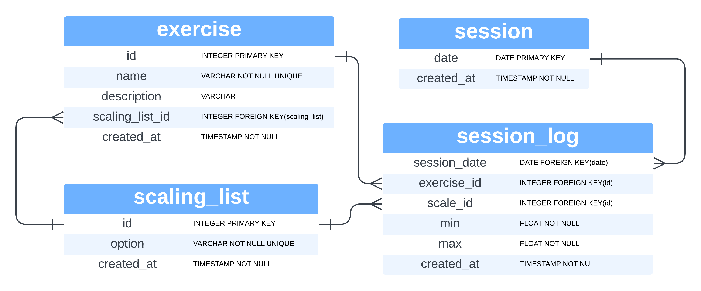

# CrossFit Class Progress Tracking App

This is a personal project designed to track my progress in CrossFit classes. The app allows me to log workout sessions, exercises, and track details like weight lifted, repetitions completed, and visualize progress over time.

## Features

- **Workout Sessions**: Log daily workout sessions. A session is equivalent to a CrossFit class.
- **Exercises**: List of CrossFit movements.
- **Workout Logs**: Keep a detailed log of each exercise in a workout session, including date, exercise type, weight, and repetitions.
- **Search and Filter**: View workout sessions by date range, search exercises by name, and filter workout logs by session or exercise.

## Project Structure

The app is built using [Cloudflare Workers](https://workers.cloudflare.com/) with the **Hono** framework and uses Cloudflare D1 (a SQLite-based database) for data persistence.

### Main Components:

- **Exercise Management**: 
  - Add, edit, and retrieve exercise details.
- **Workout Session Management**: 
  - Add new workout sessions and retrieve sessions by date.
- **Workout Logs**: 
  - Log workout details like weights and reps for each session.
- **Services**: 
  - `ExerciseService.js`: Handles the logic for managing exercises.
  - `WorkoutSessionService.js`: Manages workout session records.
  - `WorkoutLogService.js`: Manages logging details for each workout session.

## Database Schema

### Exercises Table

| Column        | Data Type      | Description                                       |
|---------------|----------------|---------------------------------------------------|
| `name`        | `VARCHAR(100)` | **Primary Key**. The name of the exercise.        |
| `description` | `TEXT`         | Description of the exercise.                     |
| `created_at`  | `TIMESTAMP`    | Defaults to the current timestamp.                |

---

### WorkoutSessions (CrossfitClass) Table

| Column         | Data Type      | Description                                        |
|----------------|----------------|----------------------------------------------------|
| `session_date` | `TIMESTAMP`    | **Primary Key**. Represents the CrossFit class session date. Defaults to current date. |
| `created_at`   | `TIMESTAMP`    | Defaults to the current timestamp.                 |

---

### WorkoutLogs Table

| Column                | Data Type      | Description                                        |
|-----------------------|----------------|----------------------------------------------------|
| `id`                  | `INTEGER`      | **Primary Key**. Auto-incremented log ID.          |
| `workout_session_date`| `TIMESTAMP`    | **Foreign Key**. References `workout_sessions(session_date)` with cascade on delete. |
| `exercise_name`       | `VARCHAR(100)` | **Foreign Key**. References `exercises(name)` with cascade on delete. |
| `weight`              | `DECIMAL(5, 2)`| The weight lifted in kg or lbs.                    |
| `reps`                | `INTEGER`      | Number of repetitions performed.                   |
| `logged_at`           | `TIMESTAMP`    | Defaults to the current timestamp.                 |

## API Endpoints

### Exercise Routes

- `GET /exercise`: Retrieve all exercises.
- `GET /exercise/:exerciseName`: Search exercises by name pattern.
- `POST /exercise`: Add a new exercise (requires `name` and `description`).

### Workout Session Routes

- `GET /sessions`: Retrieve all workout sessions.
- `POST /sessions`: Add a new workout session (defaults `session_date` to the current date).
- `GET /sessions/between`: Retrieve workout sessions between two dates (`startDate`, `endDate`).

### Workout Log Routes

- `GET /logs`: Retrieve all workout logs.
- `POST /logs`: Add a workout log (`workout_session_id`, `exercise_name`, `weight`, `reps`).
- `GET /logs/session/:workoutSessionId`: Retrieve logs by session ID.
- `GET /logs/exercise/:exerciseName`: Retrieve logs by exercise name.

## Setup and Installation

1. **Install dependencies**:

    This app runs on Cloudflare Workers using Hono, so you need to install Wrangler CLI:

    ```bash
    npm install -g wrangler
    ```

2. **Set up Cloudflare D1**:

    - Create your D1 database in the Cloudflare dashboard.
    - Link the database to your Worker environment.

3. **Run the app locally**:

    ```bash
    wrangler dev
    ```

4. **Deploy the app to Cloudflare**:

    ```bash
    wrangler deploy
    ```

## Future Improvements

### Technical
- Add tests and set up GitHub Actions
- Add linter
- Adopt a commit message standard
- Add authentication

### Functional
- At the gym, I want to be able to see the history of the exercise that I am just going to do so that I can make better decision on the start and max weight/intensity I should pick. (See wireframes)
- When I add an exercise to today's session, I want it to default to the last start weight/intensity.
- I should be able to see how my strength/endurance has improved over time. For example a graph of 1 RM Front Squat max over time or max distance run in 5 minutes over time.

### Proposed Class Diagram considering the above requirements


### Proposed Wireframes considering the above requirements


## License

This project is licensed under the MIT License.